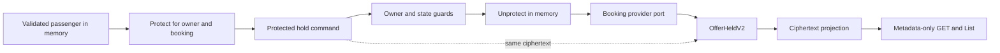

# Flights M2.2: protected passenger data

**Status:** approved on 2026-10-02; implemented by this change; verification evidence is in the [execution report](../results/2026-10-02-flights-m22-pii-protection.md), with final CI/merge tracked by the PR. Actual key provisioning, schema application and deployment remain excluded.

**Согласованный результат:** существующее бронирование одного вымышленного пассажира сохраняет новые персональные данные в зашифрованном виде. Старые заказы читаются по прежним правилам. Шифрование не ломает проекцию и обработку webhook; отсутствие ключей не превращается в plaintext fallback или выдуманный успех.

**Fresh base:** `git fetch origin dev` on 2026-10-02 resolved to `11cbb657f3cfe4f24a2d712be0c1246e1522378c`. Both `d75186054a33de0e1cb688da7e3e7cc42927dadf` and the M2.1 checkpoint `11cbb657f3cfe4f24a2d712be0c1246e1522378c` are ancestors (exit 0). The main dev checkout is clean. A new managed worktree, `C:\Users\Vladimir_sva\.codex\worktrees\flights-m22-pii-design\travel-agency`, was created at that exact SHA; the implementation branch is `codex/flights-m22-pii-protection`. No archived worktree was restored.

## 1. Scope and threat boundary

Protect **new** passenger name, date of birth, gender, email and phone snapshots, and new complete supplier webhook bodies that may contain those fields. Plaintext is necessary only while validating HTTP input, invoking a fictional/test provider, decoding an authorized protected command, or processing a verified webhook in memory. Never persist it in a new event, order projection, inbox body, durable message or diagnostic log.

Opaque owner/aggregate/provider-order/event identifiers, itinerary, price, status and existing ticket numbers remain operational metadata under current access rules. They are linkable identifiers, not anonymous data. This slice does not claim to encrypt every personal identifier, historical backup, Keycloak store, intended email delivery or memory dump. Database/inbox access without the external key material must not reveal newly protected passenger fields. A compromised running application or stolen key ring plus certificate private key is outside this protection boundary.

The existing idempotency fingerprint remains unkeyed SHA-256 over method/path/raw body. It stores no plaintext but can confirm a guessed complete request; it is not encryption. HMAC/versioned fingerprint storage is separate hardening and is not silently added here. The guarantee concerns direct plaintext in the named payload representations, not anonymity or resistance to metadata/request-guess correlation.

Included: protected hold command/event, projection/rebuild compatibility, encrypted webhook storage and its readers, safe exception/log handling, key lifecycle and a key-only initialization path, removal of Travel's OIDC booking draft persistence, and tests using fictional data.

Excluded: multi-passenger/count increases, provider passenger-ID remediation, saved profiles, multi-leg, ranking changes, passports/loyalty, retention deletion/crypto-erasure, historical data rewriting, refunds/ancillaries/SSE/Support, B5 reopening, M3 cancellation recovery and OpenSpec. No real provider/payment/Anthropic/paid API calls; paid AI-evals remain excluded. No local schema apply, migration generation/application, deployment or CI/CD configuration change. Tests that initialize databases/Host/AppHost remain CI-only unless separately authorized.

## 2. Baseline evidence before M2.2

Paths are repository-relative; F denotes `modules/flights`, and Core/Application/Infrastructure/Api denote the corresponding `Travel.Modules.Flights.*` directories under F.

| Boundary | Verified current behavior | Required change |
| --- | --- | --- |
| HTTP → command | Api `Endpoints/HoldOfferEndpoint.cs` validates one `PassengerInfo` and invokes plaintext `HoldOfferCommand`. | Protect before dispatch so the application message itself is safe to serialize. Preserve HTTP body, JWT/scope and owner derivation. |
| Handler → event | Application `HoldOfferHandler.cs` calls provider, then appends singular plaintext `OfferHeld`. | Decrypt only after owner/state guards; append a new protected event using the already-created ciphertext. |
| Aggregate | Core `BookingAggregate.Passenger` is populated by `Apply(OfferHeld)`; subsequent decisions do not inspect passenger fields. | Keep legacy Apply and add protected state without decrypting during replay. |
| Projection | Infrastructure `OrderReadModelEventApplier` serializes `held.Passenger`; `PassengerInfoJson` is jsonb. | Copy a versioned protected envelope into the same column for new events. No randomized re-encryption during replay. |
| Catch-up integrity | `OrderReadModelReconciler.ValidateCheckpointOwnershipAsync` recognizes only `OfferHeld` in the already-projected prefix. | Recognize both event versions; updating the event applier alone is insufficient. Preserve owner-conflict and stream-version checks. |
| Read DTO | `OrderView` carries `PassengerInfoJson` although public `OrderResponse` and notification rendering do not use it. | Remove this unused internal projection field from normal read/query DTOs; do not add a PII read endpoint. |
| Idempotency | Middleware stores request SHA-256 and successful response, not the raw request. Hold response contains IDs/deadline, not passenger fields. | Preserve wire replay/body equality and 24h retention; record the unkeyed-fingerprint limitation explicitly. |
| Inbox | `DuffelWebhookIngestionPort` verifies original bytes, stores raw UTF-8 JSON and publishes an inbox-ID-only command atomically. | Encrypt the verified bytes before save, preserving duplicate/transaction behavior. |
| Inbox consumers | `DuffelWebhookHandler` parses provider JSON in Application; `BookingConsistencyDiagnostics` parses `RawPayload` for correlation. | Add a version-aware Infrastructure decoder and Application-owned normalized facts; diagnostics read safe routing metadata without a PII key. |
| Logs | Duffel confirm logs raw failed payment body. `MailKitEmailSender` logs recipient/subject and rethrows original exceptions. Several JSON/profile paths log exception objects. | Remove payload/recipient logging and prevent sensitive exception text/inner exceptions from escaping to framework logs or DLQ. Preserve business outcomes. |
| Notifications | Durable envelopes carry IDs/version; user name/email are loaded from Keycloak at delivery time. | Keep durable messages free of rendered email/recipient data; retain existing status/version gates and delivery semantics. |
| Browser | Tokens/PII/attempts are in memory, but `flights-booking-draft.ts` stores provider/ref/aggregate in sessionStorage for OIDC. | Remove this Travel booking-intent persistence. Callback returns to a fresh selection instead of resuming a stored quote. |
| Startup | Non-Production EF initializer calls `MigrateAsync`; Marten initializer applies schema despite Host `AutoCreate.None`. | No normal local Host/AppHost execution in this task. Key management must exit before those registrations. |

Root/module AGENTS still describe a foundation-only frontend; B1–B5 and M2.1 source supersede that history. ADRs [0015](../../adr/0015-booking-aggregate-event-model.md), [0016](../../adr/0016-booking-saga-via-marten-es.md), [0017](../../adr/0017-flights-idempotency-strategy.md), [0018](../../adr/0018-duffel-webhook-inbox-outbox.md), [0007](../../adr/0007-storage-strategy-marten-ef-coexistence.md) and [0023](../../adr/0023-module-api-facades-and-cross-cutting-ownership.md) remain the compatibility/ownership baseline. The [M2 roadmap](2026-10-02-flights-m2-design.md) is a direction, not a claim that the protection already exists.

## 3. Alternatives and selected proposal

| Option | Consequence |
| --- | --- |
| Encrypt only the EF passenger column | Small diff, but plaintext remains in Marten events, raw inbox and diagnostics. Does not meet the boundary. |
| **Protect all new persistence boundaries with module-owned Data Protection; retain history** | Reuses authenticated encryption/key management, needs explicit ring/certificate operations and version-aware readers. Recommended for this free demonstration. |
| External PII vault with reference-only events and per-subject key deletion | Better foundation for later retention/erasure requirements, but adds storage, deletion consistency and recovery contracts not required by this slice. Defer. |

Raw-webhook minimization was considered: storing only current routing/ticket facts reduces sensitive storage but loses the original body needed for future parsing/audit. Preserve the verified bytes encrypted in this slice; expose only normalized necessary facts to the handler. Do not describe the persisted signature as proof that a modified/re-serialized body matches the supplier signature.

The earlier roadmap suggested a plural V2 event. Refine that proposal here: **M2.2 remains singular**. Passenger identity/party arrays and provider bindings belong to M2.3; that increment must explicitly evolve the event/payload contract again if needed. This costs another compatibility decision later but avoids pretending that encryption has already solved multi-passenger booking.

## 4. Contracts and data flow

### Booking

Introduce Core `ProtectedPassengerSnapshot` with `FormatVersion = 1` and opaque `Ciphertext`; its factory returns `ErrorOr<T>` and validates only the supported structural format. Core does not import crypto, DI, Data Protection or persistence APIs.

Add `OfferHeldV2(OrderId, ProtectedPassengerSnapshot PassengerSnapshot, HeldUntil, HeldAt, OwnerUserId)` implementing `IDomainEvent`. Owner is a required nonempty GUID for new writes. Keep `OfferHeld` type/namespace/registration and its legacy JSON untouched. Register V2 in Marten and handle it in the live aggregate, projection applier and checkpoint-owner validation. New Apply stores the protected snapshot and clears legacy plaintext state; old Apply retains legacy behavior. Replay does not call current validation rules or decrypt PII.

An Application `IBookingPassengerProtector` binds protection to a fixed purpose/version plus normalized aggregate and authenticated owner IDs. The API validates the current single passenger, protects it, then invokes `HoldOfferCommand` carrying `ProtectedPassenger` instead of plaintext. This is an internal command change; HTTP clients keep the existing body and exact-byte idempotency contract. No new remote subscription is introduced. Current producers use local InvokeAsync; this is not a claim that all current calls are already durable. Serialized command/DLQ tests must nevertheless prove no plaintext. Legacy command JSON missing the protected field is rejected before side effects; it is not automatically upgraded/replayed as a booking.

The handler checks command IDs, ownership and `DecideHold` before unprotecting. Decryption/shape failure means no provider call, event or outbox write. On success it supplies a short-lived `PassengerInfo` to the existing provider port, then appends V2 containing the exact protected value received. The existing external-effect-before-commit/unknown-outcome boundary remains; encryption does not make hold exactly once or recover a lost provider response.

Projection stores the V2 envelope in existing `PassengerInfoJson` jsonb. Existing rows/events remain untouched. All incremental/reset/validation paths derive identical ciphertext from the source event; no decrypt and no new nonce in the projector. Ownerless legacy holds still replay in the aggregate but fail the existing projection/owned-operation gates. Metadata reads and projection recovery work without PII keys. Projection validation proves row-to-stream agreement, not ciphertext decryptability.

Reprojecting a V1 event retains its legacy plaintext representation even if the physical row is written after cutover. “New protected writes” means new V2 bookings/new webhook deliveries, not a claim that compatibility rebuilds encrypt historical PII. Changing that legacy representation/backfilling existing rows is a separate data decision.

### Webhook inbox

Use the existing jsonb column with a discriminated new storage object: `format = "travel.flights.webhook.v1"`, inbox/source/event/type/provider-order routing metadata, and a protected payload. Keep original event ID/type/signature columns; no DDL or JSON-as-bare-ciphertext value. Encrypted original bytes retain the exact signed body. The cryptographic purpose binds **all** clear routing metadata, including nullable provider-order ID, so moving ciphertext to another row or changing metadata cannot authorize processing.

Ingress order: signature verification on original bytes → existing header/payload validation → duplicate lookup → generate inbox ID/extract routing metadata → protect → existing atomic inbox/outbox commit. A duplicate is acknowledged after signature verification without needing to decrypt/protect again. Protection failure on a new delivery returns a safe 503 and commits neither inbox nor command. The unique-index race stays handled exactly as today.

An Infrastructure `IWebhookPayloadReader` implementation recognizes legacy raw JSON and the explicit new format. Unknown/malformed new envelopes never fall back to legacy plaintext. The reader decrypts only an unprocessed entry and returns Application-owned `BookingWebhookFacts`: kind, provider-order ID and ticket numbers. Provider JSON/wire parsing moves from the handler into this reader; aggregate transitions, refund amount selection, notification versioning and acknowledgement remain in Application. The current airline-triggered refund behavior is preserved, not expanded into M3.

Already-processed entries remain no-ops without keys. Missing-key/tamper/wrong-purpose failures never mark an inbox row processed. Unsupported/malformed envelope format goes to DLQ without retry; cryptographic unavailability uses bounded existing-style delays (1s, 5s, 30s), then DLQ. Do not infer key loss versus tampering by parsing exception text. Legacy malformed raw-JSON handling retains its old safe no-op behavior; new encrypted-payload decode failures are observable failures, not successful acknowledgement.

Diagnostics obtain provider-order routing metadata from the versioned envelope without decrypting; legacy rows keep their existing correlation path. Only actual handler processing trusts metadata after authenticated unprotection and matching it against the decrypted payload. Replay remains restricted to the current command allowlist and repaired projection prerequisites; no new general replay engine or automatic bulk replay.

## 5. Keys and failure behavior

Use a dedicated Flights provider with stable application discriminator `Travel.Flights.Pii.v1`, separate purposes for booking snapshots and webhook payloads, explicit filesystem persistence and certificate protection of ring keys. Infrastructure owns this provider; do not mutate process-global ASP.NET auth/cookie Data Protection settings. Prefer the existing .NET 10 shared-framework implementation via an explicit Infrastructure framework reference; no paid KMS or third-party crypto library, and no own cipher implementation.

The Infrastructure wrapper owns/disposes a private crypto-only service provider so both `IDataProtectionProvider` and `IKeyManager` are available. Check the actual registered, non-revoked keys before normal protection; merely finding a file named `key-*.xml` is not initialization proof. Nullable routing metadata uses an explicit presence component in the purpose chain, avoiding null/string delimiter ambiguity.

Configuration under `Flights:PiiProtection`: absolute `KeyRingPath`, active certificate path/password secret, and retained read-certificate path/password secrets. Certificates/private keys/ring files live outside Git and database backups with restrictive filesystem permissions. Only opaque error codes enter logs; no passwords, key material, certificate dumps, paths or ciphertext. Wrong/missing configuration never activates machine-profile or ephemeral fallback.

Normal runtime does **not bootstrap an empty/missing ring**. A small `flights-pii-keys initialize --execute` Host command initializes only the explicitly configured ring after checking the active certificate, and refuses to replace an existing ring. It is dispatched before WebApplication/DB/Marten/Wolverine/schema initialization and calls a Flights Api.Composition facade. No new project, migrations or background service. Tests provision disposable certificates/rings; actual operator provisioning is a separate authorized action, not part of implementation or this research.

Once initialized, keep framework key rotation and retain old keys for as long as any ciphertext depends on them. Certificate rotation supplies the new active certificate plus retained certificates for reads; restart/reload behavior is tested with new provider instances, not assumed instantaneous across nodes. Back up ring and private certificates separately from the database; a database backup alone is insufficient. Test restore into a new provider instance. No key deletion/revocation/bulk re-encryption command is added.

Missing configuration leaves search, quote and metadata reads available; PII-writing hold/new-webhook paths fail with `Flights.PiiProtectionUnavailable` (503). This is a documented unavailable capability, not plaintext mode. A module diagnostic health check distinguishes NotConfigured/Unavailable/Ready; it does not claim all historical payloads were decrypt-tested. Existing process readiness continues to mean its current store/schema gates. Protected-payload failures use a safe `Flights.PiiPayloadUnavailable` response or safe durable exception; never return underlying cryptographic text. GET/List do not decrypt or expose passenger fields.

Authentication/authorization remains before public protected operations. The current request’s known pre-effect failure cannot clear an earlier unknown write. Hold retry keeps its original body/key in memory; retain existing conservative 5xx/unknown handling unless a focused test proves a narrower safe interpretation. No new client operation store.

Official references checked for this proposal: [configuration and certificate rotation](https://learn.microsoft.com/en-us/aspnet/core/security/data-protection/configuration/overview?view=aspnetcore-10.0), [key lifetime/deletion](https://learn.microsoft.com/en-us/aspnet/core/security/data-protection/implementation/key-management?view=aspnetcore-10.0), [purpose isolation](https://learn.microsoft.com/en-us/aspnet/core/security/data-protection/consumer-apis/purpose-strings?view=aspnetcore-10.0), [dedicated provider API](https://learn.microsoft.com/en-us/dotnet/api/microsoft.aspnetcore.dataprotection.dataprotectionprovider.create?view=aspnetcore-10.0). These establish framework capabilities, not proof of a deployed key backup/rotation procedure. No real keys were created during research.

## 6. Logs, exceptions and browser behavior

- Remove Duffel raw payment response logging. Provider JSON failures must cross the Infrastructure boundary as privacy-safe failures without original body-bearing inner exceptions. Preserve known failure versus unknown external outcome; do not relabel a failed confirmation as a known non-operation.
- Mail sender logs operation/status only, never recipient, subject or rendered body. Failures are sanitized before rethrow to prevent Wolverine/DLQ from retaining SMTP responses containing addresses. Keycloak profile and webhook JSON errors get the same treatment. Preserve cancellation and existing fallback/retry semantics; do not swallow errors or change where notifications go.
- Capture structured log values, exception strings/inner exceptions and relevant Activity tags in tests with distinctive fictional sentinels. Successful notification messages remain IDs/version only; rendered email exists at the intended delivery boundary, not in durable envelopes. No emails are sent to real recipients.
- Remove Travel's `write/takeFlightsBookingDraft` path and its persisted provider/ref/aggregate intent. On an unauthenticated booking action, explain that login will require selecting/checking the offer again. After the full redirect callback, show authenticated fresh search/selection; no automatic quote/hold/confirm from persisted state. Already-authenticated and isolated demo paths can keep the existing in-memory re-quote flow.
- A one-time best-effort deletion of the exact legacy Travel sessionStorage key is permitted; do not read/restore it, enumerate unrelated storage, or write a replacement. Access tokens and passenger/operation state remain memory-only. OIDC library protocol-state handling is unchanged; do not claim a real OIDC login leaves every browser-storage key empty. Fake auth remains a demo build replacement, never an API bypass.
- UI states: ordinary input validation, login/reselection, encrypted-hold success, privacy-service unavailable, expiry, unknown write, owner/auth change and eventual projection lag. Missing keys never synthesize Held/Cancelled/Ticketed. Logout/navigation invalidate visible PII and late responses; no claim of securely zeroing immutable .NET/JS strings.

## 7. Compatibility, acceptance and operational limits

| ID | Acceptance requirement | Evidence |
| --- | --- | --- |
| P1 | New hold command/event/read-row serialization lacks all passenger sentinel values; provider receives the exact validated passenger once on the success path. | Unit, no-DB HTTP, controlled-handler integration in CI |
| P2 | Legacy owned/ownerless event JSON retains its replay behavior; V2 catch-up/rebuild/owner-prefix validation works; projection copies ciphertext exactly and needs no key. | Serialized-event tests, real Marten/EF CI |
| P3 | Correct purpose/owner/aggregate succeeds; wrong context/tamper/missing key/unknown format fails closed; no provider call on protect/unprotect failure. | Real-crypto unit + handler tests |
| P4 | New inbox bytes are ciphertext at rest; signed duplicates/unique races/outbox atomicity still work; unreadable unprocessed payload is not acknowledged; diagnostics correlate without keys. | Port/reader unit + real DB/outbox/worker CI |
| P5 | Ring restart, data-key rotation, certificate rotation and backup/restore preserve old/new decryptability; empty/missing ring never silently bootstraps; key-only command cannot initialize DB/schema. | Disposable filesystem/certificate tests; source/composition guards; CI process smoke |
| P6 | No PII or secrets appear in logs, exception/DLQ material, URLs or new browser storage. APIs expose no new passenger fields; foreign/ownerless access remains blocked. | Capture-log tests, HTTP auth regression, durable serialization/CI |
| P7 | Login callback requires fresh selection without a persisted Travel intent; same-tab authenticated/demo booking and B3–B5 regressions remain correct. | Angular unit, isolated Playwright; real issuer acceptance is a separate claims check, not proved by fake auth |
| P8 | Existing SQL schema/migration inventory is unchanged. Mandatory CI remains enabled; no paid evaluation/provider call or local schema apply. | Diff/architecture/schema-model checks and CI |

Deployment compatibility is asymmetric: the new reader understands V1/V2, while old binaries do not understand V2/encrypted inboxes. Before a future deployment, stop/drain all old booking writers and webhook/projection/notification consumers, install the complete new reader/writer set and provision keys, then reopen writes. Do not run mixed generations or claim rollback is just swapping binaries. Rollback after V2 writes requires retaining compatible readers or an explicit restore/data plan; no event rewriting in M2.2.

Historical plaintext events/rows/inbox/backups remain a named legacy exception. Encryption of new writes does not fix them; no real passenger data is allowed. Crypto-shredding, retention periods and actual deletion require separate decisions. Losing the only key/private certificate copy can make data irrecoverable; the application must report unavailability rather than invent a passenger or fallback to plaintext.

No application tests, Host/AppHost, certificates, keys or schemas were run/created in this design turn. Source inspection is not runtime encryption proof. The [implementation plan](../plans/2026-10-02-flights-m22-pii-protection.md) separates safe local checks from schema-creating CI lanes. A SQL change, new real integration requirement or need to weaken authentication is an unexpected blocker to explain before proceeding.

## 8. Self-review and next gate

Self-review checked all new persistence sinks, the distinction between current inline invocation and possible durable serialization, legacy owner semantics, the overlooked prefix-owner check, deterministic ciphertext projection, no-key reads, webhook acknowledgement ordering, key-only startup and browser redirect loss. It also distinguishes operational identifiers from protected passenger fields, migration-free storage from mixed-reader compatibility, and a key probe from a proof that every historic ciphertext is readable.

The recommended design is now concrete for approval, not implemented. Approval of this specification and plan authorizes the selected M2.2 implementation/test/review/commit/push/PR/green-CI/merge/dev-sync/cleanup cycle under the original task instructions. It does not authorize real key provisioning, migration execution, deployment, historical data mutation or starting M2.3/M3.
